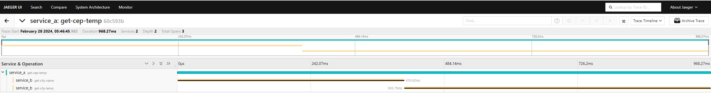
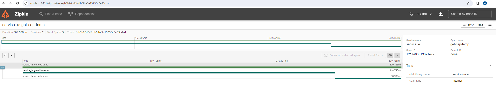

# Serviços

## Serviço A
Estes serviço recebe um **CEP** e realiza uma chamada ao **serviço B**

## Serviço B
Este serviço recebe um **CEP** válido e realiza uma chamada ao **weather API** para apresentar **cidade**, temperatura em **celsus**, **fahrenheit** e **kelvin**

# Como Executar
Para executar o projeto basta executar o comando abaixo:
```
docker compose up
```

Para realizar o request no serviço A pode executar com RestClient no [arquivo](./service_a/api/cep.http)

# Visualizando resultado
Para visualizar usando o Jaeger basta acessar o [painel](http://localhost:16686/search) e poderá visualizar informações sobre o request conforme a imagem abaixo



Para visualizar usando o Zipkin basta acessar o [painel](http://localhost:9411/zipkin) e oiderá visualizar informações sobre o request conforme a imagem abaixo

